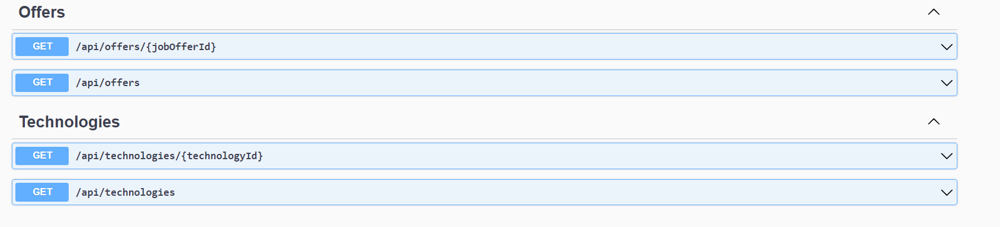
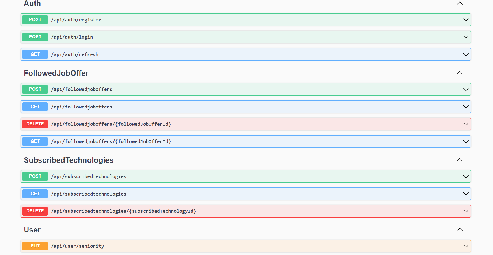

## Architecture


## Project description

Project aim was to aggregate job offers from most popular polish services with IT job offers into one place
Thanks to it Application provide features like : 
- Adding job offer to favourite offers . 
- Subscribe technologie that user is intrested in 
- Set desired seniority

Based on subscribed technologies and desired seniority application will send mails to all users with new personalized job offers special for each user.

Events timing : 
- On first aplication start offers will be scrapped (init scrap) , later after every 3 hours database will be updated with new added offers(update scrap)
- Mail sending feature(sending mail to users with personalized job offers) by default will run every 3 hours
- Outdated offers by default will be delated at 22:00 and 04:00

## Endpoints
- Job offer service has endpoints related to job offers
 

- Users service has endpoints realted to user 


After application start you can explore this endpoints :
- JobOffersService : http://localhost:7206/swagger/index.html
- UsersService : http://localhost:7104/swagger/index.html

By default services avaliable on : 
- JobOffersService : http://localhost:7206/
- UsersService : http://localhost:7104/

## List of used technologies/libraries/frameworks :
- Application: ASP.NET Core , Entity Framework , RabbitMq , SqlServer , Firebase Auth , Serilog , Quartz , AutoMapper , MailKit ,
- Testing: xUnit , Moq ,  FlunetAssertions , Bogus , WebApplicationFactory
- Infrastructure : Docker , Docker Compose , Shell 

## Requirements
- Docker

## How to run it ?

Before starting docker-compose if you want to access auth routes and/or mail sending server you need to setup some environment.

- Go to firebase.google.com and sign in 
- Create a new project 
- Navigate to Authentication and click "Get started"
- Select Email/Password Sign-in provider
- Go to Project Settings
- In general tab you will find your Web API key 
- Go to Service accounts tab and click Generate new private key (You will download json file)
- Name this file firebase.json
- Place firebase.json at the root of UsersService
- Go to docker-compose.yml at the root of the project - find user service and complete env variables with adding firebase project api key and project name to appropriate places

Simple video of getting firebase.json and api key : https://www.youtube.com/watch?v=xBuLWaDcvu0 . Between 00:57 - 2:40

- If you want emails with personalized offers for the user to be sent, you need to configure smtp environmental variables in mailsendingservice in docker-compose.yml

Simple video how to get this env variables : https://www.youtube.com/watch?v=1YXVdyVuFGA

After this config navigate to the root of the Project and run the command : 

```shell 
docker-compose up -d
```


