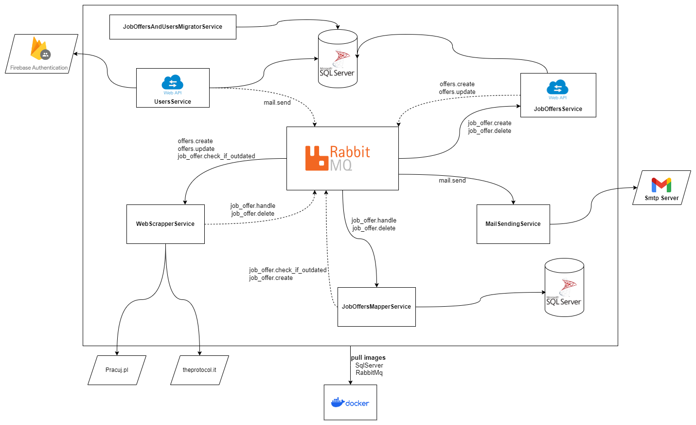

## Architecture




## How to run it ?

Before starting docker-compose if you want to access auth routes and/or mail sending server you need to setup some environment.

- Go to firebase.google.com and sign in 
- Create a new project 
- Navigate to Authentication and click "Get started"
- Select Email/Password Sign-in provider
- Go to Project Settings
- In general tab you will find your Web API key 
- Go to Service accounts tab and click Generate new private key (You will download json file)
- Name this file firebase.json
- Place firebase.json at the root of UsersService
- Go to docker.compose.yml at the root of the project - find user service and complete env variables with adding firebase project api key and project name to appropriate places

Simple video of getting firebase.json and api key : https://www.youtube.com/watch?v=xBuLWaDcvu0 . Between 00:57 - 2:40

- If you want emails with personalized offers for the user to be sent, you need to configure environmental variables in mailsendingservice in docker-compose.yml

Simple video how to get this env variables : https://www.youtube.com/watch?v=1YXVdyVuFGA

After this config navigate to the root of the Project and run the command

```shell 
docker-compose up -d
```


